# Лабораторная работа №3

## Ход работы

### Установка minikube и kubectl
Установил из официального репозитория для моего дистрибутива.
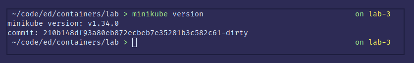

Как и kubectl
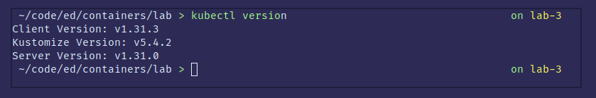

### Запуск minikube
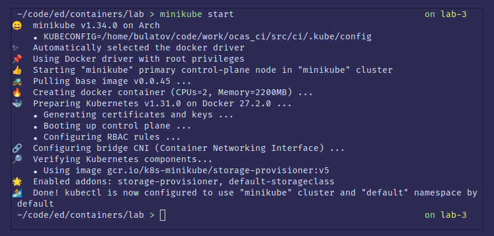

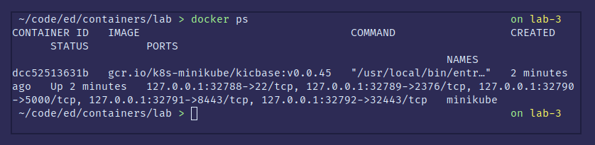

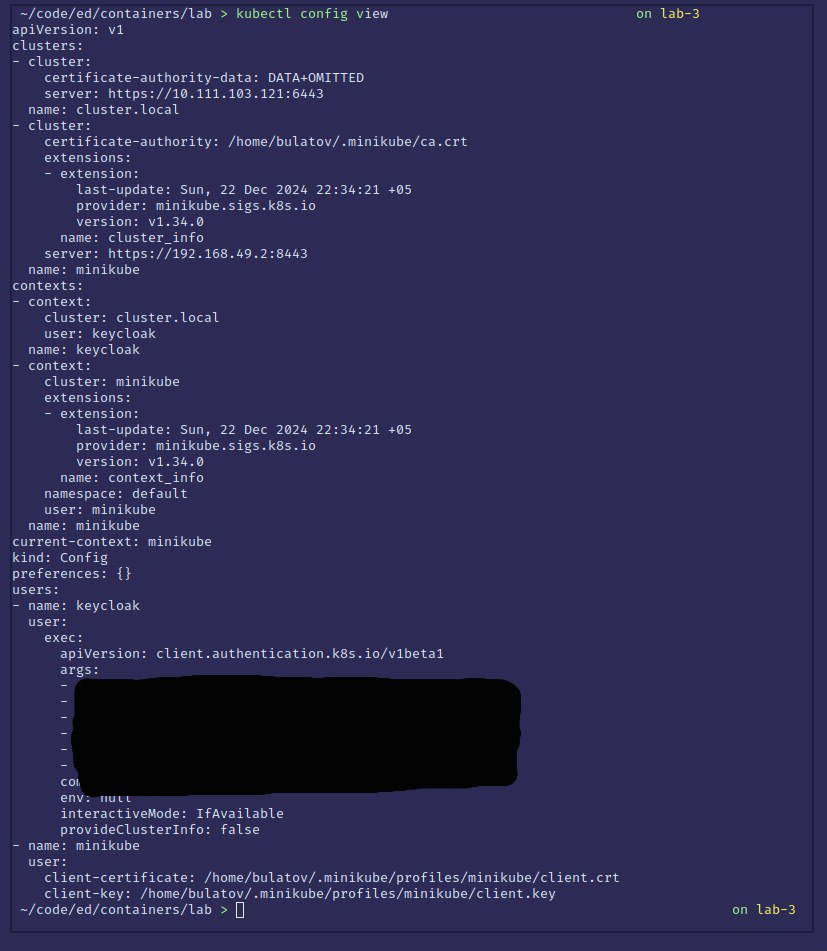

### Создание ресурсов
Создаем нужные конфигмапы, секреты, сервисы и деплои

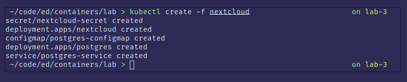

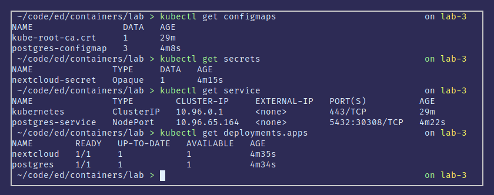

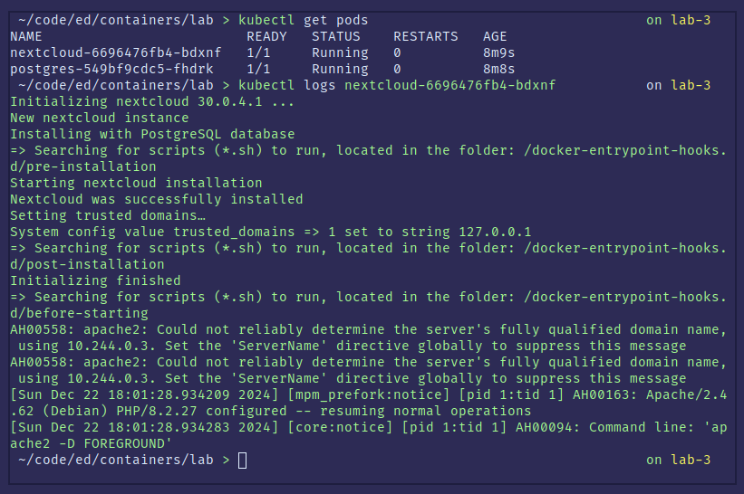

### Подключение извне

Запускаем туннель minikube

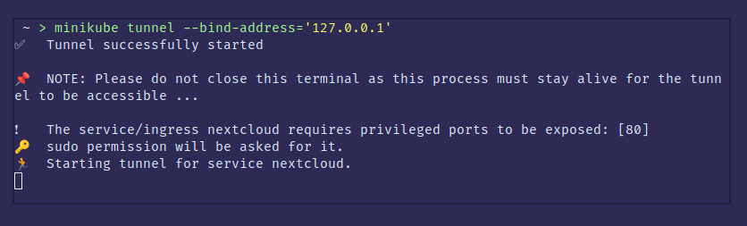

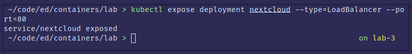

### Результаты

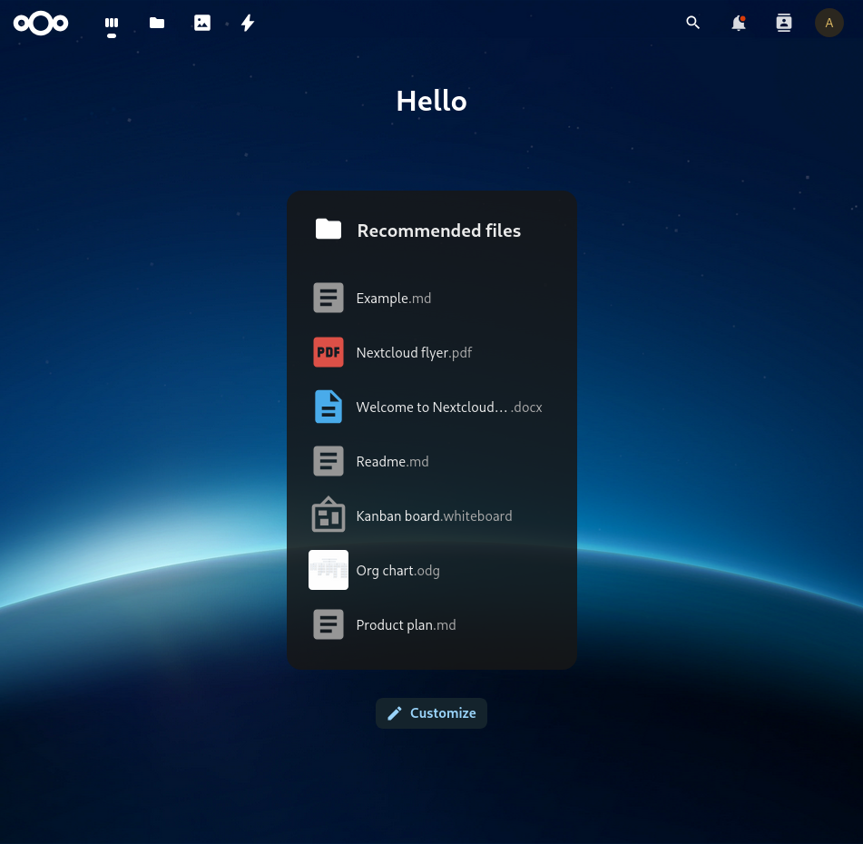

### Дашборд

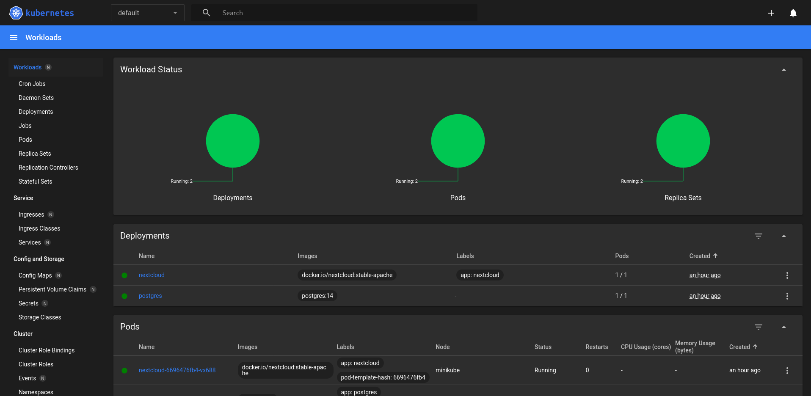

## Вопросы
1. Порядок имеет значение, т.к деплои ссылаются на конфигмапы и секреты. Конфигмапы и секреты должны бысть созданы до деплоя.
2. Nextcloud отдает 500 ошибки так как у него нет подключения к базе данных. ~~Оно не восстанавливается, как как после --scale 1 postgres уже на новом поде с другим адресом,
   а nextcloud все еще стучится к старому. Если сделать ре-деплой у nextcloud то все заработает~~
   Nextcloud обращается не к поду, а к сервису, причем по его названию, а не по IP-адресу. Сервис уже перенапраляет трафик на под.
   Подключение не восстанавливается по каким-то внутренним причинам nextcloud.
   Еще при --scale 0 и обратно мы потеряем все данные в БД
