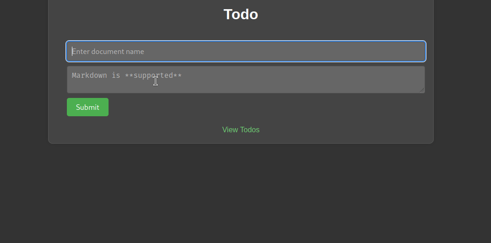

# Лабораторная работа №2

## Введение
Представлен простой сервис, позволяющий оставлять и смотреть заметки в формате Markdown.



## Архитектура
Caddy используется как веб-сервер для раздачи статических файлов, листинга директории с заметками и шаблонизации заметок.
Отправленную форму для заметок Caddy перенаправляет в веб-приложение на python, реализующее сохранение заметок на диск.
Caddy стартует с включенным admin-endpoint, доступным для других сервисов. При старте init-сервис отправляет на admin-endpoint запрос с конфигурацией сервера.


## Вопросы
- Можно ли ограничивать ресурсы (например, память или CPU) для сервисов в docker-compose.yml? Если нет, то почему,
если да, то как?

Да:
```yml
# внутри определения сервиса
resources:
limits:
  cpus: '0.001'
  memory: 50M
```

- Как можно запустить только определенный сервис из docker-compose.yml, не запуская остальные?

Да, например запустим сервис `web` из данного проекта
```sh
docker compose up -d web
```

## Предостережение
Сервис не предназначен для использования в production-среде. Он может содержать path-traversal, template injection уязвимости и прочие неприятности.
Сервис существует исключительно в учебных целях.
